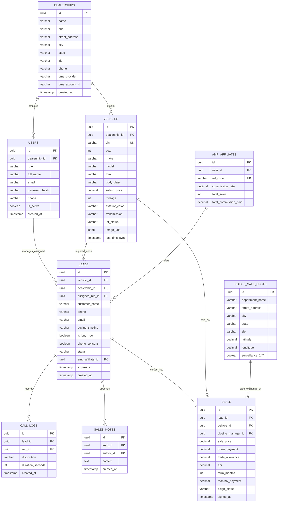

# OMP DEALS — DATABASE ARCHITECTURE & SCHEMA SPECIFICATION (`DATABASE.md`)

## 1. Architecture Overview

- **Primary Database Engine:** PostgreSQL 15+ (Relational, ACID compliant, JSONB support for DMS feeds).
- **In-Memory Cache & Pub/Sub:** Redis 7+ (Real-time 10-second engagement radar, active dwell sessions, BUY NOW WebSocket broadcast alerts).
- **Separation Constraint:** Zero shared tables or foreign keys with CRM nErgy.

---

## 2. Entity-Relationship Diagram (ERD)



---

## 3. Data Dictionaries & SQL DDL Schemas

### 3.1 `dealerships` Table
Represents authorized automotive dealer entities (e.g. Auto Money Motorcars LLC).

```sql
CREATE TABLE dealerships (
    id UUID PRIMARY KEY DEFAULT gen_random_uuid(),
    name VARCHAR(150) NOT NULL,
    dba VARCHAR(150),
    street_address VARCHAR(200) NOT NULL,
    city VARCHAR(100) NOT NULL,
    state VARCHAR(2) NOT NULL,
    zip VARCHAR(10) NOT NULL,
    phone VARCHAR(20) NOT NULL,
    dms_provider VARCHAR(50) DEFAULT 'CDK', -- 'CDK', 'DealerSocket', 'Frazer'
    dms_account_id VARCHAR(100),
    is_pilot_dealer BOOLEAN DEFAULT FALSE,
    created_at TIMESTAMP WITH TIME ZONE DEFAULT CURRENT_TIMESTAMP
);

-- Seed Auto Money Motorcars LLC
INSERT INTO dealerships (name, dba, street_address, city, state, zip, phone, is_pilot_dealer)
VALUES ('Auto Money Motorcars LLC', 'Auto Money', '1450 SE 17th St', 'Fort Lauderdale', 'FL', '33316', '(954) 555-0182', TRUE);
```

---

### 3.2 `users` Table
Stores authentication credentials and access control for the 7 system roles.

```sql
CREATE TABLE users (
    id UUID PRIMARY KEY DEFAULT gen_random_uuid(),
    dealership_id UUID REFERENCES dealerships(id) ON DELETE SET NULL,
    role VARCHAR(30) NOT NULL CHECK (role IN ('GUEST', 'LIAISON', 'SALES_REP', 'SALES_MGR', 'DEALER_PRO', 'BROKER', 'AMP_AFFILIATE', 'EXECUTIVE_ADMIN')),
    full_name VARCHAR(120) NOT NULL,
    email VARCHAR(180) UNIQUE NOT NULL,
    password_hash VARCHAR(255) NOT NULL,
    phone VARCHAR(25),
    is_active BOOLEAN DEFAULT TRUE,
    created_at TIMESTAMP WITH TIME ZONE DEFAULT CURRENT_TIMESTAMP
);

CREATE INDEX idx_users_email ON users(email);
CREATE INDEX idx_users_role ON users(role);
```

---

### 3.3 `vehicles` Table
Maintains the 42 verified in-stock vehicles with DMS synchronization timestamps.

```sql
CREATE TABLE vehicles (
    id UUID PRIMARY KEY DEFAULT gen_random_uuid(),
    dealership_id UUID NOT NULL REFERENCES dealerships(id) ON DELETE CASCADE,
    vin VARCHAR(17) UNIQUE NOT NULL,
    year INT NOT NULL CHECK (year BETWEEN 1900 AND 2027),
    make VARCHAR(60) NOT NULL,
    model VARCHAR(80) NOT NULL,
    trim VARCHAR(80),
    body_class VARCHAR(50), -- 'Coupe', 'Sedan', 'Pickup', 'SUV', 'Class 4-6 Box', 'Class 7-8 Semi'
    selling_price DECIMAL(12, 2) NOT NULL,
    mileage INT NOT NULL,
    exterior_color VARCHAR(50),
    transmission VARCHAR(50) DEFAULT 'Automatic',
    lot_status VARCHAR(30) DEFAULT 'AVAILABLE' CHECK (lot_status IN ('AVAILABLE', 'HOLD', 'PENDING_SALE', 'SOLD')),
    image_urls JSONB DEFAULT '[]'::jsonb,
    last_dms_sync TIMESTAMP WITH TIME ZONE DEFAULT CURRENT_TIMESTAMP,
    created_at TIMESTAMP WITH TIME ZONE DEFAULT CURRENT_TIMESTAMP
);

CREATE INDEX idx_vehicles_lot_status ON vehicles(lot_status);
CREATE INDEX idx_vehicles_price ON vehicles(selling_price);
CREATE INDEX idx_vehicles_dealer ON vehicles(dealership_id);
```

---

### 3.4 `leads` Table
Central CRM entity created when a customer answers the 10-second AI intent modal.

```sql
CREATE TABLE leads (
    id UUID PRIMARY KEY DEFAULT gen_random_uuid(),
    vehicle_id UUID REFERENCES vehicles(id) ON DELETE SET NULL,
    dealership_id UUID NOT NULL REFERENCES dealerships(id) ON DELETE CASCADE,
    assigned_rep_id UUID REFERENCES users(id) ON DELETE SET NULL,
    amp_affiliate_id UUID REFERENCES users(id) ON DELETE SET NULL,
    customer_name VARCHAR(120) NOT NULL,
    phone VARCHAR(25) NOT NULL,
    email VARCHAR(180),
    buying_timeline VARCHAR(40) NOT NULL CHECK (buying_timeline IN ('NOW or within 24 hours', 'Within 2-5 days', '1 week', 'Just Browsing')),
    is_buy_now BOOLEAN GENERATED ALWAYS AS (buying_timeline = 'NOW or within 24 hours') STORED,
    phone_consent BOOLEAN NOT NULL DEFAULT FALSE,
    dwell_duration_seconds INT DEFAULT 10,
    status VARCHAR(30) DEFAULT 'New' CHECK (status IN ('New', 'Assigned', 'In Progress', 'Test Drive Scheduled', 'Contract Pending', 'Closed Won', 'Closed Lost', 'Expired')),
    expires_at TIMESTAMP WITH TIME ZONE DEFAULT (CURRENT_TIMESTAMP + INTERVAL '24 hours'),
    created_at TIMESTAMP WITH TIME ZONE DEFAULT CURRENT_TIMESTAMP,
    updated_at TIMESTAMP WITH TIME ZONE DEFAULT CURRENT_TIMESTAMP
);

CREATE INDEX idx_leads_buy_now ON leads(is_buy_now) WHERE is_buy_now = TRUE;
CREATE INDEX idx_leads_status ON leads(status);
CREATE INDEX idx_leads_assigned_rep ON leads(assigned_rep_id);
CREATE INDEX idx_leads_created_at ON leads(created_at DESC);
```

---

### 3.5 `call_logs` Table
Maintains sales representative dialer telemetry and call dispositions.

```sql
CREATE TABLE call_logs (
    id UUID PRIMARY KEY DEFAULT gen_random_uuid(),
    lead_id UUID NOT NULL REFERENCES leads(id) ON DELETE CASCADE,
    rep_id UUID NOT NULL REFERENCES users(id) ON DELETE RESTRICT,
    disposition VARCHAR(60) NOT NULL CHECK (disposition IN (
        'Connected - Test Drive Scheduled',
        'Connected - Pricing Discussed',
        'Connected - Not Interested',
        'Left Voicemail',
        'No Answer / Busy',
        'Wrong Number'
    )),
    duration_seconds INT DEFAULT 0,
    scheduled_test_drive TIMESTAMP WITH TIME ZONE,
    created_at TIMESTAMP WITH TIME ZONE DEFAULT CURRENT_TIMESTAMP
);

CREATE INDEX idx_call_logs_lead ON call_logs(lead_id);
CREATE INDEX idx_call_logs_rep ON call_logs(rep_id);
```

---

### 3.6 `sales_notes` Table
Append-only timestamped notes log for auditability.

```sql
CREATE TABLE sales_notes (
    id UUID PRIMARY KEY DEFAULT gen_random_uuid(),
    lead_id UUID NOT NULL REFERENCES leads(id) ON DELETE CASCADE,
    author_id UUID NOT NULL REFERENCES users(id) ON DELETE RESTRICT,
    content TEXT NOT NULL,
    created_at TIMESTAMP WITH TIME ZONE DEFAULT CURRENT_TIMESTAMP
);

CREATE INDEX idx_sales_notes_lead ON sales_notes(lead_id);
```

---

### 3.7 `deals` Table (60s Desking & Contract Closure)
Structured installment contracts for paperless auto e-signing.

```sql
CREATE TABLE deals (
    id UUID PRIMARY KEY DEFAULT gen_random_uuid(),
    lead_id UUID NOT NULL REFERENCES leads(id) ON DELETE CASCADE,
    vehicle_id UUID NOT NULL REFERENCES vehicles(id) ON DELETE RESTRICT,
    closing_manager_id UUID REFERENCES users(id) ON DELETE SET NULL,
    sale_price DECIMAL(12, 2) NOT NULL,
    down_payment DECIMAL(12, 2) NOT NULL DEFAULT 0.00,
    trade_allowance DECIMAL(12, 2) DEFAULT 0.00,
    trade_payoff DECIMAL(12, 2) DEFAULT 0.00,
    doc_fee DECIMAL(10, 2) DEFAULT 899.00,
    tax_amount DECIMAL(10, 2) NOT NULL,
    apr DECIMAL(5, 2) NOT NULL,
    term_months INT NOT NULL CHECK (term_months IN (24, 36, 48, 60, 72, 84)),
    monthly_payment DECIMAL(10, 2) NOT NULL,
    dealer_reserve DECIMAL(10, 2) DEFAULT 0.00,
    esign_status VARCHAR(30) DEFAULT 'DRAFT' CHECK (esign_status IN ('DRAFT', 'SENT', 'VIEWED', 'SIGNED', 'FUNDED')),
    signed_at TIMESTAMP WITH TIME ZONE,
    created_at TIMESTAMP WITH TIME ZONE DEFAULT CURRENT_TIMESTAMP
);

CREATE INDEX idx_deals_vehicle ON deals(vehicle_id);
CREATE INDEX idx_deals_status ON deals(esign_status);
```

---

### 3.8 `amp_affiliates` Table (Referral Commission Tracking)
Tracks flat $250 commissions for Jessica Morales and AMP partners.

```sql
CREATE TABLE amp_affiliates (
    id UUID PRIMARY KEY DEFAULT gen_random_uuid(),
    user_id UUID NOT NULL REFERENCES users(id) ON DELETE CASCADE,
    ref_code VARCHAR(40) UNIQUE NOT NULL,
    commission_rate DECIMAL(10, 2) DEFAULT 250.00,
    total_clicks INT DEFAULT 0,
    total_sales INT DEFAULT 0,
    total_commission_paid DECIMAL(12, 2) DEFAULT 0.00,
    created_at TIMESTAMP WITH TIME ZONE DEFAULT CURRENT_TIMESTAMP
);

CREATE INDEX idx_amp_ref_code ON amp_affiliates(ref_code);
```

---

### 3.9 `police_safe_spots` Table
Coordinates for 1,600+ designated Police Safe Spots.

```sql
CREATE TABLE police_safe_spots (
    id UUID PRIMARY KEY DEFAULT gen_random_uuid(),
    department_name VARCHAR(150) NOT NULL,
    street_address VARCHAR(200) NOT NULL,
    city VARCHAR(100) NOT NULL,
    state VARCHAR(2) NOT NULL,
    zip VARCHAR(10) NOT NULL,
    latitude DECIMAL(10, 7) NOT NULL,
    longitude DECIMAL(10, 7) NOT NULL,
    surveillance_247 BOOLEAN DEFAULT TRUE,
    created_at TIMESTAMP WITH TIME ZONE DEFAULT CURRENT_TIMESTAMP
);

CREATE INDEX idx_safe_spots_geo ON police_safe_spots(state, city);
```
