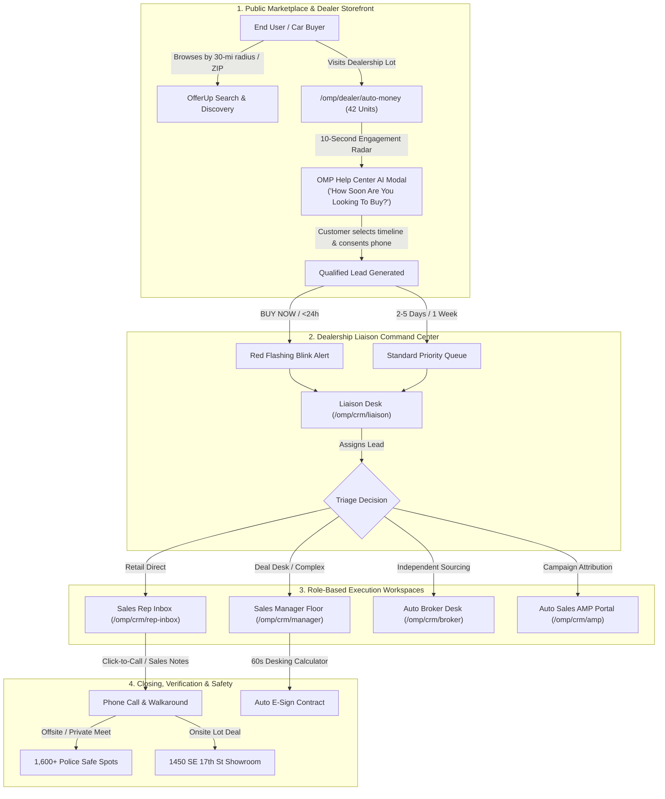

# OMP DEALS — END-TO-END SYSTEM WORKFLOW SPECIFICATION (`FLOW.md`)

## 1. System Overview & Context

OMP Deals is an AI-powered classifieds, automotive marketplace, and integrated Lead CRM platform. The immediate business objective is a **realistic live test with One Auto Dealer in South Florida ("Auto Money Motorcars LLC", Fort Lauderdale, FL)** before a full nationwide rollout.

> **CRITICAL BOUNDARY:** OMP Deals is strictly independent of CRM nErgy. No cross-database merges, no foreign port 3000 dependencies, and no dummy implementations.

---

## 2. High-Level System Architecture & Flow Diagram

---

## 3. Detailed Step-by-Step Workflows

### Workflow 1: Public Buyer Browsing & 10-Second Engagement Radar

1. **Discovery & Radius Search:**
   - Buyer visits `http://localhost:3001/` or `/cars-trucks`.
   - Buyer selects location: **Fort Lauderdale, FL** and radius: **30 miles**.
   - Buyer filters by body style (Class 1-8 light/medium duty, Coupe, SUV, Pickup, Classic).
2. **Navigating to Auto Money Lot:**
   - Buyer clicks the **"South Florida Live Test Pilot • Auto Money"** banner or navigates to `/omp/dealer/auto-money`.
   - The storefront displays the 42 live units (e.g. 2024 Corvette Stingray 2LT, 2024 Ford F-150 Lariat 4x4, 1969 Camaro SS 396 Classic).
3. **10-Second Engagement AI Radar Hook:**
   - The client-side engagement hook starts a silent 10-second timer when a vehicle listing or dealership lot page is rendered.
   - If the user scrolls, views gallery images, or stays active for **10 seconds**, the **OMP Help Center AI Intent Modal** triggers non-intrusively.
4. **AI Buying Intent Qualification:**
   - The modal asks: *"How soon are you looking to buy this vehicle?"*
   - Options presented:
     1. **`NOW or within 24 hours`** (Flags lead as `BUY NOW` - top priority).
     2. **`Within 2-5 days`** (Flags lead as High Priority).
     3. **`1 week`** (Flags lead as Standard Qualified).
     4. **`Just Browsing / Information Only`** (Informational lead).
   - Phone Opt-in: Buyer enters their phone number and checks the consent box: *"I consent to have Auto Money contact me via call or SMS regarding this vehicle."*
   - On submission, the lead is stored via `leadStorage.js` / API.

---

### Workflow 2: Dealership Liaison Command Center & Lead Triage

1. **Incoming Lead Ingestion (`/omp/crm/liaison`):**
   - Elena Rostova (Dealership Liaison) monitors the incoming queue.
   - Leads with intent `NOW or within 24 hours` trigger a **High-Priority Red Blinking Flashing Alert** with audio/visual ping.
   - Leads display a 24-hour expiration countdown timer.
2. **Evaluation & Assignment Modal:**
   - The Liaison reviews buyer notes, vehicle VIN, price, and selected buying timeline.
   - The Liaison opens the **Assign Lead** modal:
     - Assigns to **Sales Rep (Tony Ramirez)** for immediate retail Click-to-Call.
     - Assigns to **Sales Manager (Carlos Vega)** for commercial fleet or complex credit deals.
     - Assigns to **Auto Broker (Devon Miller)** if vehicle needs custom sourcing.
     - Assigns to **Auto Sales AMP (Jessica Morales)** for affiliate referral attribution.
3. **Audit Trail:**
   - Every assignment updates the lead's status to `Assigned` with a timestamp and assignee name.

---

### Workflow 3: Sales Rep Lead Intake, Click-to-Call & Sales Notes

1. **Inbox Notification (`/omp/crm/rep-inbox`):**
   - Tony Ramirez (Sales Rep) views his assigned lead queue.
   - `BUY NOW` leads stay pinned at the top with glowing flame icons.
2. **Click-to-Call Dialer:**
   - Rep clicks the **Call** button next to the customer's phone number.
   - Triggers native dialer (`tel:+1...`) on mobile or initiates Twilio/WebRTC call on desktop.
   - Call log modal opens automatically: records call disposition (`Spoke with Customer`, `Left Voicemail`, `Call Back Scheduled`, `Test Drive Booked`).
3. **Timestamped Sales Notes:**
   - Rep enters customer conversation notes (e.g. *"Customer wants trade-in appraisal on 2018 Civic, test drive booked for 4pm today"*).
   - Notes are permanently appended to the lead dossier with rep ID and ISO timestamp.

---

### Workflow 4: Sales Manager Floor Oversight & 60-Second Desking

1. **Floor Management (`/omp/crm/manager`):**
   - Carlos Vega (Sales Manager) tracks active leads, close velocity, and salesperson conversion rates.
2. **60-Second Desking Deal Calculator (`/omp/desking/calculator`):**
   - Manager structures retail installment contracts:
     - Vehicle Selling Price
     - Down Payment & Trade-In Allowance
     - Term (36, 48, 60, 72 months)
     - Interest Rate (APR) & Lender Tier (Prime vs Subprime)
     - Sales Tax (Broward County / FL 6% + discretionary surtax) & Doc Fee ($899)
   - Real-time recalculation of monthly payment and dealer reserve.
3. **Auto E-Sign Contracts (`/omp/deals/e-sign`):**
   - Digital contract generation sent via SMS/Email for paperless e-signing.

---

### Workflow 5: Auto Dealership GM ("Auto Money") DMS Inventory Sync

1. **Verified Storefront (`/omp/verified-dealer`):**
   - Marcus Vance (GM) manages dealership profile, business hours, and showroom images.
2. **DMS Feed Ingestion (`/omp/feed-sync`):**
   - Connects to CDK, DealerSocket, or Frazer FTP/API feeds.
   - Synchronizes 42 vehicles: VIN, Year, Make, Model, Trim, Mileage, Exterior Color, Status (`Available`, `Pending`, `Sold`).
   - Zero-ghost-listing rule: Vehicles marked sold in DMS are removed from the public marketplace within 60 seconds.

---

### Workflow 6: Auto Broker Deal Sourcing & Private Negotiation

1. **Broker Desk (`/omp/crm/broker`):**
   - Devon Miller (Auto Broker) manages client dossiers seeking hard-to-find vehicles.
   - Leverages AI Cars & Trucks body class locator to source matching vehicles across dealer networks.
   - Submits structured purchase offers directly to dealership floor managers.

---

### Workflow 7: Auto Sales AMP (Affiliate Marketing Program)

1. **Affiliate Portal (`/omp/crm/amp`):**
   - Jessica Morales (AMP Affiliate) generates tracked campaign links:
     `http://localhost:3001/cars-trucks?ref=AMP-JESSICA-2026`
2. **Commission Attribution:**
   - Link clicks and leads are tagged with `ref_code`.
   - When a referred customer buys a vehicle at Auto Money, the system logs a **$250 flat affiliate commission**.
   - Performance dashboard shows total clicks, qualified test drives, and paid commissions.

---

### Workflow 8: Trust & Safety (Police Safe Spots & Insured Shipping)

1. **1,600+ Police Safe Spots:**
   - For private party sales or offsite test drives, buyers and sellers select designated Police Department parking bays (well-lit, 24/7 video surveillance).
   - In South Florida: Fort Lauderdale Police Dept Safe Exchange Bay (SE 1st Ave).
2. **Nationwide Insured Doorstep Shipping:**
   - Integrated shipping calculator calculates freight costs based on mileage from Fort Lauderdale lot to buyer ZIP code.
   - Enclosed vs open carrier options with real-time transit insurance.
