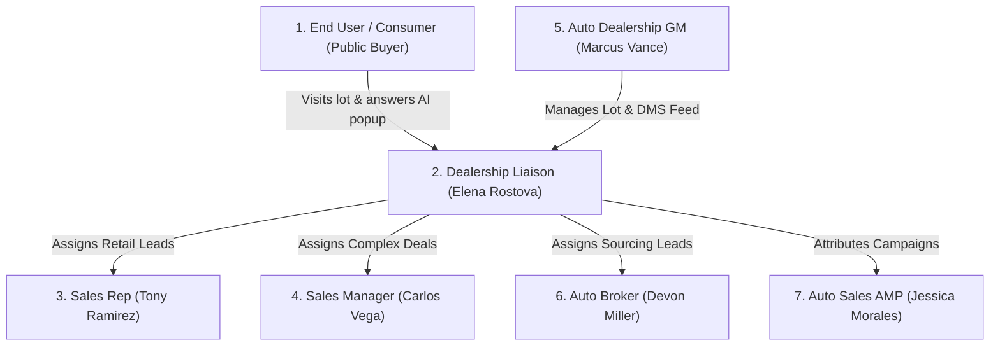

# OMP DEALS — PRODUCT REQUIREMENTS DOCUMENT (`PRD.md`)

## 1. Document Overview

| Attribute | Details |
| :--- | :--- |
| **Product Name** | OMP Deals Marketplace & Integrated Lead CRM |
| **Version** | 2.4.0 (South Florida Live-Test Release) |
| **Target Pilot Dealer** | Auto Money Motorcars LLC • 1450 SE 17th St, Fort Lauderdale, FL 33316 |
| **Inventory Scope** | 42 Verified In-Stock Vehicles |
| **Primary System Boundary** | Strict separation from CRM nErgy (No shared port 3000, no merging) |

---

## 2. Business Context & Objective

The primary objective is to execute a **realistic live test with One Auto Dealer in South Florida ("Auto Money")** prior to a wider regional and national launch.

### Business Goals:
1. **Validate OfferUp-Style Engagement:** Verify consumer willingness to browse within a 30-mile local radius and trigger the 10-second engagement AI radar.
2. **AI Buying Intent Qualification:** Capture buyer purchasing timeline (`BUY NOW / <24h`, `2-5 days`, `1 week`, `Just Browsing`) and explicit phone consent.
3. **Multi-Tier CRM Triage:** Deliver high-priority `BUY NOW` flashing alerts to the Dealership Liaison and empower Sales Reps with instant Click-to-Call dialers and sales notes.
4. **Zero Ghost Listings:** Maintain 100% accurate DMS synchronization for the 42 lot vehicles.

---

## 3. User Personas & System Roles

The system strictly supports the **7 client-specified roles**:

### Role 1: End User / Consumer (`GUEST`)
- **Profile:** South Florida retail vehicle buyer or private seller.
- **Responsibilities:** Browse cars within 30 miles/ZIP, view Auto Money lot, view vehicle details for 10 seconds, answer AI purchase intent modal, consent to phone contact.
- **Default Route:** `/` (Marketplace Home)

### Role 2: Dealership Liaison (`LIAISON`) — Elena Rostova
- **Profile:** Main OMP Platform Manager operating the central triage desk.
- **Responsibilities:** Monitor incoming lead stream, evaluate red-blinking `BUY NOW` leads, distribute leads to Sales Reps, Managers, Brokers, or AMP affiliates.
- **Default Route:** `/omp/crm/liaison`

### Role 3: Sales Rep (`SALES_REP`) — Tony Ramirez
- **Profile:** Dealership retail salesperson on the showroom floor.
- **Responsibilities:** Manage assigned lead queue, respond immediately to `BUY NOW` flashing alerts, execute direct Click-to-Call dialer, log call dispositions, write timestamped sales notes.
- **Default Route:** `/omp/crm/rep-inbox`

### Role 4: Sales Manager (`SALES_MGR`) — Carlos Vega
- **Profile:** Dealership floor lead and finance authority.
- **Responsibilities:** Oversee entire sales floor deal velocity, structure installment contracts in the 60-second Desking Deal Calculator, execute auto e-sign contracts.
- **Default Route:** `/omp/crm/manager`

### Role 5: Auto Dealership GM (`DEALER_PRO`) — Marcus Vance
- **Profile:** General Manager of Auto Money Motorcars LLC.
- **Responsibilities:** Manage dealership digital storefront, monitor 42 live lot units, configure CDK/DealerSocket DMS feeds, track store conversion metrics.
- **Default Route:** `/omp/verified-dealer`

### Role 6: Auto Broker (`BROKER`) — Devon Miller
- **Profile:** Independent vehicle negotiator and buyer advocate.
- **Responsibilities:** Manage client purchase dossiers, search marketplace vehicles across dealer networks, submit negotiated offers directly to dealership floor managers.
- **Default Route:** `/omp/crm/broker`

### Role 7: Auto Sales AMP (`AMP_AFFILIATE`) — Jessica Morales
- **Profile:** Affiliate partner driving qualified traffic via referral campaigns.
- **Responsibilities:** Share unique tracked campaign links, track clicks and inquiries, receive $250 flat commission per vehicle sold through their link.
- **Default Route:** `/omp/crm/amp`

---

## 4. Functional Requirements

### FR-1: OfferUp-Style 8 Category Public Marketplace
- System must provide full-width public browsing across 8 categories:
  1. `AI Cars & Trucks`
  2. `For Sale`
  3. `Local Services`
  4. `Job Finder`
  5. `Real Estate`
  6. `Business For Sale`
  7. `Looking For` (Buyer wanted board)
  8. `MyFav` (Saved searches and bookmarks)
- Location filter default: **Fort Lauderdale, FL (30-mile radius)**.

### FR-2: Class 1-8 Auto Classification Engine
- Search filter by vehicle weight classes:
  - Class 1-3: Light Duty (Coupes, Sedans, Small Pickups, SUVs)
  - Class 4-6: Medium Duty (Box trucks, Flatbeds, Walk-in Vans)
  - Class 7-8: Heavy Duty (Tractor trailers, Dump trucks, Cement mixers)
  - Antique & Classic Cars (1969 Camaro, Corvette Stingray, Ford Mustang, etc.)

### FR-3: Auto Money Public Dealership Storefront (`/omp/dealer/auto-money`)
- Dedicated verified dealer profile showing:
  - Dealership Name: Auto Money Motorcars LLC
  - Address: 1450 SE 17th St, Fort Lauderdale, FL 33316
  - Hours: Mon-Sat 9:00 AM - 7:30 PM
  - In-Stock Inventory: 42 active vehicles with photos, mileage, specs, and price.

### FR-4: 10-Second Engagement AI Radar Hook
- Client-side tracking must monitor active user time on Auto Money inventory listings.
- When an active session reaches **10 seconds** without bouncing, the Help Center AI Purchase Intent Modal is triggered.

### FR-5: OMP Help Center AI Purchase Intent Modal
- Modal title: *"OMP Help Center • How Soon Are You Looking To Buy?"*
- Mandatory 4 radio options:
  - `NOW or within 24 hours` -> flags lead with `BUY NOW` hot alert
  - `Within 2-5 days` -> flags lead as High Priority
  - `1 week` -> flags lead as Standard Priority
  - `Just Browsing` -> flags lead as Informational
- Phone number input field + TCPA explicit consent checkbox.

### FR-6: Dealership Liaison Triage Desk (`/omp/crm/liaison`)
- Central incoming lead table with real-time refresh.
- `BUY NOW` hot leads must feature a **Red Flashing Pulse Alert** and stay pinned at the top.
- 24-hour expiration countdown timer on newly submitted leads.
- Lead assignment modal to delegate to Rep, Manager, Broker, or AMP affiliate.

### FR-7: Sales Rep Inbox & Click-to-Call Dialer (`/omp/crm/rep-inbox`)
- Personalized queue showing leads assigned to that specific salesperson.
- Working Click-to-Call action triggering device dialer (`tel:+1...`).
- Post-call disposition modal (`Connected`, `Left Voicemail`, `Test Drive Scheduled`).
- Timestamped sales notes textarea appending entries to the lead record.

### FR-8: 60-Second Desking Deal Calculator (`/omp/desking/calculator`)
- Inputs: Selling Price, Cash Down, Trade Allowance, Loan Term (36-72 mo), APR, Tax/Doc Fees.
- Outputs: Exact monthly payment, total interest, dealer finance reserve.
- 1-Click transfer to digital contract for Auto E-Sign (`/omp/deals/e-sign`).

### FR-9: Auto Sales AMP Attribution Engine (`/omp/crm/amp`)
- Generates unique affiliate referral URLs: `?ref=AMP-<CODE>`.
- Automatically logs referral cookie/session for 30 days.
- Credits $250 commission record upon status change of lead to `Delivered / Sold`.

### FR-10: Trust, Safety & Shipping
- 1,600+ Police Safe Spots directory with map pins at verified police station parking bays.
- Doorstep insured shipping calculator computing mileage and transport pricing from Fort Lauderdale.

---

## 5. Non-Functional Requirements

| Metric | Target | Verification Method |
| :--- | :--- | :--- |
| **Initial Page Load** | < 1.5 seconds | Vite production bundle (<200KB gzip) |
| **AI Radar Trigger Accuracy** | Exactly 10s ± 0.5s | Client-side timer test |
| **BUY NOW Alert Latency** | < 500ms | Real-time lead state sync |
| **Browser Compatibility** | Chrome, Safari, Edge, Firefox, iOS, Android | Modern ECMAScript 2022+ |
| **Separation Integrity** | 0 external requests to CRM nErgy port 3000 | Network audit inspection |

---

## 6. Acceptance Criteria (South Florida Live-Test Pilot)

1. [x] Public user can browse Auto Money lot vehicles in Fort Lauderdale.
2. [x] 10-second browsing triggers Help Center AI Purchase Intent popup.
3. [x] Selecting "NOW or within 24 hours" creates a BUY NOW hot lead with red blinking alert.
4. [x] Dealership Liaison can evaluate and assign the lead to a Sales Rep.
5. [x] Sales Rep can view assigned lead, trigger Click-to-Call, and record timestamped sales notes.
6. [x] Sales Manager can structure retail installment deal in the 60s desking calculator.
7. [x] AMP Affiliate portal tracks clicks and logs $250 commission per car sold.
8. [x] Zero dependency or references to CRM nErgy codebase.
